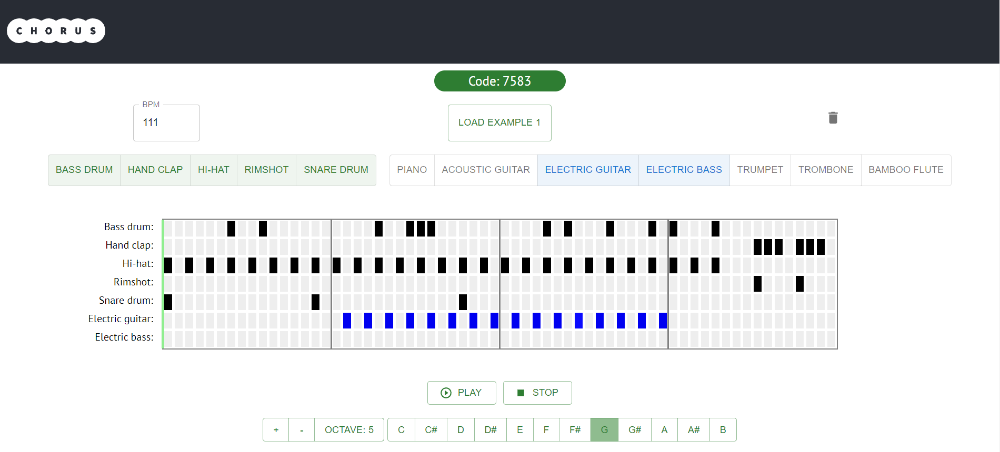

# Chorus: Make Music with Friends

A React web app for making musical beat loops with friends online. Click the cells to add notes to the loop, and use the room code to invite your friends to help out! 

Followed this tutorial for setting up a React app: https://courses.cs.northwestern.edu/394/guides/quick-react.php.  

The app is currently hosted here: https://chorus-79ba5.web.app/
